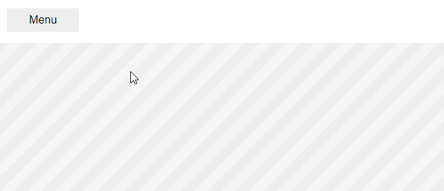

# Tiny Drawer

*Version 2.0*

Really small mobile menu navigation sliding in from the left.

## In short

- Only 1kb
- Vanilla JS
- Zero dependencies
- Super simple setup
- Callback support
- No content wrapper needed
- Remember scroll position on close



*The real thing is much smoother than this animated gif*

## Usage

It just can't get any simpler than this. There is also an example in `index.html`.

### CSS

```html
<link rel="stylesheet" href="assets/css/dist/tinyDrawer.min.css">
```

### HTML

```html
<drawer-menu>Put your menu here</drawer-menu>
<div data-drawer-open>Trigger to open menu</div>
```

### JS

```html
<script src="assets/js/dist/tinyDrawer.min.js"></script>
<script>
tinyDrawer();
</script>
```

## Options

### replacement

To prevent possible collision with other scrips you change `drawer` in data attributes to something else.

```js
tinyDrawer({
  replacement: 'drawer'
});
```

*Be aware! If you change this option, you also need to match it in the css file.*

### drawer-selector

```js
tinyDrawer({
  drawerSelector: 'drawer-menu'
});
```

*Be aware! If you change this option, you also need to match it in the css file.*

### callback

If you need to trigger other actions when the menu state changes, you can use a callback.

- `element` is the element that triggered the change.
- `action` is `open` or `close` depending on what happends.

```js
tinyDrawer({
  callback: function(element, action) {
    console.log(element);
    console.log(action);
  }
});
```

## HTML methods

## Open

```html
<div data-drawer-open>Trigger to open menu</div>
```

## Close

```html
<div data-drawer-close>Trigger to open menu</div>
```

## JS methods

### open

If you need to programmically trigger the menu to open you can use this method.

```js
tinyDrawerOpen();
```

### close

If you need to programmically trigger the menu to close you can use this method.

```js
tinyDrawerClose();
```

## Other information

### How to style it

Use classes instead of styling the element or attributes directly. That way you will separate your style from the core style.

### The reason for data attributes

For `open` and `close` triggers, data attributes are used. That way logic is not mixed with your styling (which should be put into classes).

### The reason for custom elements

The `drawer-menu` is used like a component. To make it stand out from all the other elements, it's using a custom element.

All major browsers has support for custom elements.

## Donate

Donate to [DevoneraAB](https://www.paypal.me/DevoneraAB) if you want.

## License

MIT